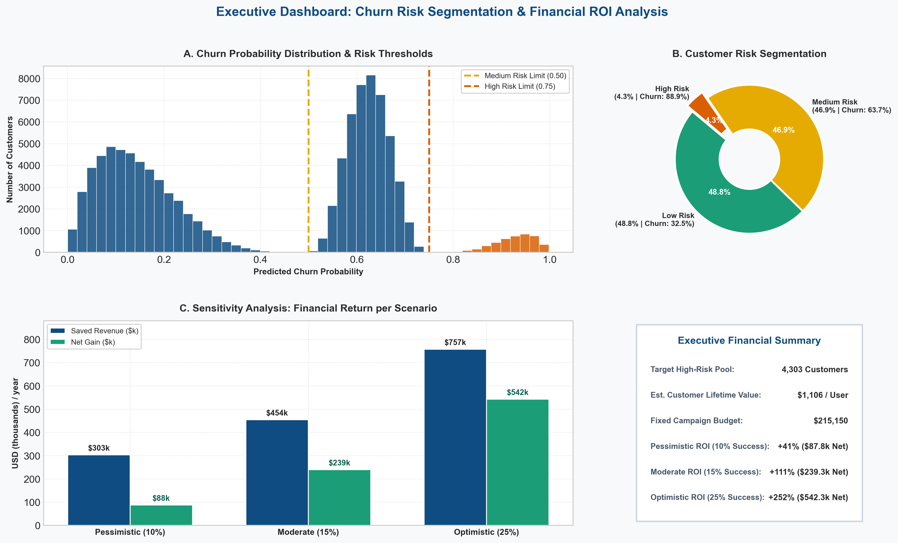

# 📉 Customer Churn Prediction & Risk Mitigation System

---

## Problem Statement

Dalam industri telekomunikasi yang sangat kompetitif, biaya untuk mengakuisisi pelanggan baru jauh lebih tinggi dibandingkan mempertahankan pelanggan yang ada. Perusahaan menghadapi tantangan utama berupa:

* **High Churn Rate:** Terjadinya penurunan jumlah pelanggan aktif secara berkala tanpa adanya deteksi dini terhadap sinyal kepuasan/perilaku.
* **Data Quality & Complexity:** Dataset historis yang berukuran besar (100.000 pelanggan) memiliki ketidaklengkapan data (*missing values*) yang signifikan pada kolom demografis opsional, serta potensi *multicollinearity* antar atribut penggunaan.
* **Informed Retention Strategy:** Kurangnya model prediktif berbasis probabilitas yang dapat memberikan estimasi risiko *churn* secara akurat untuk memandu tim *marketing* dan *customer service*.

Proyek ini bertujuan untuk membangun *end-to-end Machine Learning Pipeline* yang mampu memprediksi risiko *churn* pelanggan serta mengidentifikasi faktor-faktor pemicu utamanya (*churn drivers*).

---

## Methodology

### A. Data Integration & Cleaning
* **Data Merging:** Penggabungan dataset log perilaku (`Record.csv`) dan profil perangkat (`Client.csv`) berbasis `Customer_ID` melalui *Inner Join*.
* **Quality Filtering:** Berdasarkan analisis pada visualisasi di atas (*Missing Value Rate per Feature*), kolom demografis opsional pihak ketiga dengan *missing value rate* > 30% (`numbcars`, `dwllsize`, `HHstatin`, `ownrent`, `dwlltype`, `lor`) **dieliminasi** untuk menjaga integritas data.

### B. Feature Preprocessing & Pipeline Construction
* **Imputation & Scaling:** Fitur numerik bergejala *missing values* ringan (< 3%) diimputasi menggunakan nilai *median*, diikuti penyetaraan skala via `StandardScaler`.
* **Categorical Encoding:** Variabel kategorikal diubah menjadi representasi numerik menggunakan `OneHotEncoder`.
* **Multicollinearity Removal:** Pengujian *Variance Inflation Factor* (VIF) dilakukan untuk mendeteksi dan mengeliminasi fitur-fitur yang saling berkolerasi tinggi secara berlebihan.
* **Encapsulation:** Seluruh tahapan imputasi dan enkoding dibungkus ke dalam `scikit-learn Pipeline`.

### C. Pemodelan & Cross-Validation
* **Algoritma yang Diuji:** *Logistic Regression*, *Random Forest Classifier*, dan *HistGradientBoostingClassifier*.
* **Hyperparameter Tuning:** Optimasi parameter dilakukan menggunakan `GridSearchCV` yang dikombinasikan dengan skema `StratifiedKFold` untuk mengatasi isu ketidakseimbangan kelas (*class imbalance*).
* **Metrik Evaluasi:** Pengujian berfokus pada *ROC-AUC*, *Average Precision* (Precision-Recall Curve), *Brier Score Loss* (kalibrasi probabilitas), serta *Permutation Feature Importance*.

---

## Result and Insight

### A. Hasil Performa Model
* **Model Terbaik:** Algoritma berbasis Gradient Boosting (*HistGradientBoosting*) memberikan kinerja generalisasi terbaik pada data uji dengan stabilitas nilai *ROC-AUC* dan *Average Precision* yang unggul dibandingkan model linier maupun *tree* standar.
* **Performa Model Terbaik (*HistGradientBoosting*):**
  Skor ROC-AUC (0.7209) Mengindikasikan bahwa model memiliki kemampuan pemisahan (*discriminative power*) yang cukup solid. Secara praktis, nilai ROC-AUC sebesar 0.72 berarti terdapat **probabilitas 72%** bagi model untuk memberikan skor risiko *churn* yang lebih tinggi kepada pelanggan yang benar-benar akan *churn* dibandingkan pelanggan yang tetap setia.
* **Penyetaraan Threshold Optimal (0.5815):** Dengan menggeser ambang batas klasifikasi ke angka **0.5815**, model berhasil mengamankan **Recall ~60%**. Artinya, model mampu menangkap setidaknya **6 dari 10 pelanggan** yang berisiko *churn* secara tepat waktu untuk segera ditindaklanjuti oleh tim retensi.
* **Efisiensi Algoritma:** Dibandingkan model *tree* konvensional maupun *Logistic Regression*, *HistGradientBoosting* jauh lebih unggul dalam menangani populasi data besar (100.000 sampel) serta mengindikasikan bahwa batas informasi fitur (*feature information boundary*) pada dataset ini telah dieksplorasi secara optimal.

### B. Gambaran Perilaku Pelanggan (Key Insights)
* **Perubahan Pola Penggunaan (`change_mou`):** Penurunan durasi penggunaan (*Minutes of Use*) bulanan merupakan prediktor tercepat dan terkuat yang mengindikasikan pelanggan sedang berpindah ke penyedia layanan lain.
* **Usia Perangkat (`eqpdays`):** Semakin lama durasi penggunaan perangkat tanpa pembaruan (*upgrade*), semakin tinggi kecenderungan pelanggan untuk mengalami *churn*.
* **Fluktuasi Tagihan Bulanan:** Pelanggan yang mengalami ketidakstabilan biaya tagihan cenderung lebih sensitif terhadap keputusan *churn*.

---

## Risk Analysis

### A. Segmentasi Risiko Pelanggan 
Berdasarkan distribusi probabilitas model pada populasi pelanggan:
* **High Risk (4.3% dari populasi | Churn Rate Riil: 88.9%):** Sebanyak **4,303 pelanggan** berada pada segmen paling kritis ( > 75%).
* **Medium Risk (46.9% dari populasi | Churn Rate Riil: 63.7%):** Segmen transisi yang membutuhkan pemantauan berkala ( 50% - 75%).
* **Low Risk (48.8% dari populasi | Churn Rate Riil: 32.5%):** Segmen paling stabil dengan risiko terkecil ($\text{Prob} < 0.50%).

### B. Intervention Scenario pada High Risk Group
| Skenario Intervensi | Success Rate | Pelanggan Terselamatkan  | Saved Revenue | Keuntungan Bersih  | ROI |
| :--- | :---: | :---: | :---: | :---: | :---: |
| **Pessimistic Scenario** | **10%** | **~430 user** | **$303.000** | **$87.800** | **+41%** |
| **Moderate Scenario** | **15%** | **~645 user** | **$454.000** | **$239.300** | **+111%** |
| **Optimistic Scenario** | **25%** | **~1.075 user** | **$757.000** | **$542.300** | **+252%**
---
Angka ini didasarkan pada asumsi perusahaan mengalokasi biaya untuk mempertahankan customer sebesar $50 per orang (fixed budget $215.150) yang difokuskan pada 4.303 pelanggan segmen paling kritis ( > 0,75% probabilitas). Setiap pelanggan yang berhasil ditahan menyumbang pendapatan tahunan sebesar ~$704 (rata-rata tagihan bulanan $58,72 dikalikan 12 bulan). Pada skenario respon terburuk 10% (hanya 430 pelanggan yang batal churn), total pendapatan yang diselamatkan mencapai $303.000, sehingga perusahaan tetap memperoleh keuntungan bersih sebesar $87.800 (+41% ROI) setelah dikurangi biaya modal promosi.

## Recommendation

Berdasarkan temuan data dan hasil prediksi model, berikut adalah rekomendasi strategis untuk tim bisnis dan operasional:

* **Implementasi Sistem EWS (Early Warning System):**      
   Integrasikan skor probabilitas dari model *HistGradientBoosting* ke dalam sistem CRM. Pelanggan dengan probabilitas *churn* > 60% secara otomatis dikategorikan sebagai *High-Risk*.
* **Program Retention Terfokus (Preventive Action):**     
   Tawarkan program *trade-in* atau subsidi pembaruan perangkat khusus untuk pelanggan dengan nilai `eqpdays` tinggi yang terdeteksi masuk dalam segmen berisiko tinggi atau bisa dengan memberikan penawaran paket kuota/bonus durasi bagi pelanggan yang menunjukkan penurunan nilai `change_mou` selama 2 bulan berturut-turut.
* **Efisiensi Anggaran Pemasaran:**     
   Alihkan alokasi insentif promosi masal menjadi penawaran yang dipersonalisasi (*targeted retention*), sehingga anggaran dapat difokuskan hanya pada pelanggan bernilai tinggi (*high-value*) yang berisiko lepas.

---
